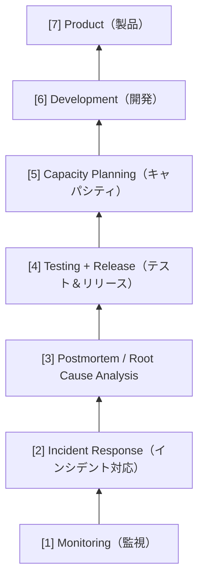
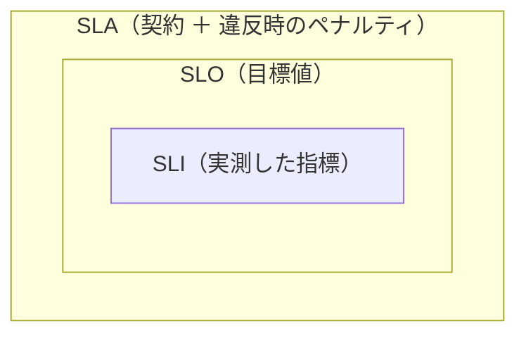

## はじめに
「DevOps」や「SRE」という言葉について、言葉自体は知っているけど、具体的な理解ができていないということで、まとめていきます。

### 対象読者
- SREの原則や考え方について整理したい方
- 「SRE」という言葉を耳にするが、具体的に自分たちのコードにどう影響するのか知りたい開発者。
- モダンなWeb開発現場で必須となっている「信頼性」の考え方の基礎を固めたい方。

### この記事で得られること
- SREと連携することで、コードの書き方やリリースの判断基準（エラーバジェットなど）がどう変わるかのイメージ
- 共通言語（SLI/SLO）を使って、感情ではなく数値でトリアージ（優先順位付け）を行うマインド

## SRE(Site Reliability Engineering)とは
### SREの定義
　SREとは、「Site Reliability Engineering」の略称です。Google社によって提唱され、ソフトウェアエンジニアリングの手法を用いてITインフラや運用の問題に取り組む学問・アプローチのことです。

GoogleのSRE本では以下のようになってます。
>SRE is what happens when you ask a software engineer to design an operations team.
>意訳すると、「SREとは、ソフトウェアエンジニアがシステム運用を設計したら、どのような組織になるか」を体現したもの

GoogleのSRE本は[こちら](https://sre.google/sre-book/introduction/)

つまり、従来のインフラ/運用エンジニアがやっていたことを、ソフトウェアエンジニアリングの視点で再設計したのが SREと言えそうです。

### なぜ今、SREを学ぶ必要があるのか
- 手作業による運用の限界（トイルの撲滅）
　従来の「人手」に頼る運用では、マイクロサービス化やクラウド活用によるシステムの複雑化・巨大化に対応できません。サービス成長に伴い運用負荷が指数関数的に増える中、ソフトウェア工学の手法を用いて運用を自動化し、**「サービスの成長を阻害しない運用」**を実現する必要があります。

- 開発チームと運用チームのジレンマ
　「速くリリースしたい」開発チームと「安定させたい」運用チームの目標は、伝統的に対立してきました。SREはこの相反する目標を、エラーバジェットという共通の数値目標で管理し、ジレンマを解消します。これにより、信頼性を維持しつつ、ビジネス価値（新機能）を最大スピードで提供できるようになります。

### SREの目的
システムの信頼性を「ユーザーが満足するレベル」で維持しつつ、開発のスピードを最大化すること

## DevOpsとSREの違い
「DevOps」と同じじゃない？と思ったそこのあなた。
その考えは間違ってはいなく、DevOpsとSREは関係しています。
端的に言うと、DevOpsは「開発チームと運用チームで協力し合い、サービスの価値を高めていく」という「概念」です。そして、SREはDevOpsを実現するための具体的な取り組みです。

GoogleのSRE本では、以下のような言葉で表現されています。
>One could equivalently view SRE as a specific implementation of DevOps with some idiosyncratic extensions.
>SREは独自の拡張を加えたDevOpsの具体的な実装と捉えることができる

### DevOps5本柱とSRE7原則の対応関係
#### DevOpsの5つの重要な柱
詳細については割愛します

1. 失敗を当たり前のように受け入れる
2. 組織のサイロ化を減らす
3. 徐々に変化させる
4. ツールと自動化を活用する
5. すべてを測定する

#### SREの7つの原則
GoogleのSRE本「Part II - Principles」で扱われている章立てに対応する、SREの中核となる7つの原則です。

1. **リスクを受け入れる（Embracing Risk）**

   - **リスクの受け入れ方**: 100%の信頼性を目指すことは、実はユーザーにとってもビジネスにとっても最適ではない、というのが核心的な主張。信頼性をある水準を超えてさらに高めようとするとコストが非線形に増大し（1段階の改善に100倍のコストがかかることも）、ユーザーは回線品質など「より不安定な要素」に支配されているため 99.99% と 99.999% の差を認識できない。
   - **リスクの測定**: 可用性をダウンタイムの時間ではなくリクエスト成功率で定義するのがGoogleのアプローチ。可用性目標は「最低ライン」であると同時に「超えすぎてはいけない上限」でもある。
   - **エラーバジェット**: 許容できる失敗の量を定量化し、速度と信頼性の対立を解消する仕組み（詳細は用語集の「エラーバジェット」を参照）。

   原文は [Embracing Risk - Google SRE Book](https://sre.google/sre-book/embracing-risk/) を参照。

2. **サービスレベルオブジェクティブ（Service Level Objectives）**

   SLI（指標）とSLO（目標値）を用いて「どの程度の信頼性を提供するか」を定量的に定義する。ポイントは「100%を目指さない」こと。達成不能な目標はイノベーションを阻害し、コストを増大させる（詳細は用語集の「SLI / SLO / SLA」を参照）。

3. **トイルをなくす（Eliminating Toil）**

   手作業・繰り返し・自動化可能で長期的価値のない作業（トイル）を、ソフトウェアエンジニアリングによって自動化・削減する。SREはトイル対応時間を50%未満に抑え、残りをエンジニアリングプロジェクトに充てることを目標とする（詳細は用語集の「トイル」を参照）。

4. **分散システムのモニタリング（Monitoring Distributed Systems）**

   信頼性の階層構造の最も基礎となる層。システムの状態を可視化し、人ではなくシステムが問題を検知できるようにする。アラートは「人が今すぐ対応すべきもの」に絞ることが重要。

5. **自動化の推進（Automation）**

   反復作業を自動化することで、一貫性・スピード・スケーラビリティを高め、人的ミスを減らす。「自分の仕事をなくすための自動化」を志向するのがSRE的な発想。

6. **リリースエンジニアリング（Release Engineering）**

   ビルド・デプロイを再現可能かつ安全に行うための仕組み。カナリアリリースやロールバックの仕組みを整備し、リリースに伴うリスクを最小化する。

7. **シンプルさ（Simplicity）**

   信頼性とシンプルさは表裏一体。本質的でない複雑さ（accidental complexity）を排除し、システムを理解・運用しやすく保つことが、長期的な信頼性につながる。

#### 表形式で簡単に比較

1. 「失敗を当たり前のように受け入れる」と「リスクを受け入れる」

| 観点 | DevOps（失敗の受け入れ） | SRE（リスク管理） |
| :--- | :--- | :--- |
| **姿勢** | 失敗は避けられないものとして文化的に受け入れる | 失敗を定量化して意図的に設計に組み込む |
| **目的** | 失敗から素早く学び、回復力を高める | 失敗の量を最適なレベルにコントロールする |
| **アプローチ** | 心理的安全性・Blameless Postmortemなど文化・プロセス重視 | エラーバジェット・SLOなど数値・指標重視 |
| **失敗の扱い** | 失敗 = 学習機会（定性的） | 失敗 = 消費されるバジェット（定量的） |
| **上限の考え方** | 失敗を減らすことに上限は設けない | 信頼性を高めすぎることも明示的に避ける |
| **チーム構造** | 開発・運用の境界をなくす（You build it, you run it） | 開発チームとSREという役割分担を維持しつつ共通指標で協調 |

2. 「ツールと自動化を活用する」と「トイルをなくす」

| 観点 | DevOps（ツールと自動化） | SRE（トイルの撲滅） |
| :--- | :--- | :--- |
| **目的** | 手作業を減らし開発・運用を効率化する | トイルを定量化し、運用負荷を抑える |
| **測定** | 自動化の適用範囲を重視 | トイル時間を定期的に計測（50%未満を目標） |
| **アプローチ** | CI/CDなどのツール導入 | 自動化に加え、エンジニアリング時間の確保を制度化 |

## SREの実践：信頼性の階層構造
Dickerson's Service Reliability Hierarchy では、基礎から応用に向けて以下の層が積み上がるモデルを示している。

- [7] Product（製品）
- [6] Development（開発）
- [5] Capacity Planning（キャパシティプランニング）
- [4] Testing + Release（テスト＆リリース）
- [3] Postmortem / Root Cause Analysis
- [2] Incident Response（インシデント対応）
- [1] Monitoring（監視）  ← 最も基礎

下の層がなければ上の層は機能しない。まず監視から始めるのが鉄則。

## 用語集
### SLI / SLO / SLA
3つは「実測 → 目標 → 契約」という入れ子の関係にある。SLI（実測した指標）を土台にSLO（目標値）を定め、それをユーザーとの契約（SLA）として約束する、という階層構造になっている。

#### **SLI（Service Level Indicator）**
サービスレベルを測定する定量的な指標。代表的なものはレイテンシ・エラーレート・スループット・可用性。
平均値より**パーセンタイル**（99th, 99.9th）で見ることが重要で、平均はロングテールを隠してしまう。

#### **SLO（Service Level Objective）**
SLIの目標値。「99%のリクエストを100ms以内に返す」のような形で定義する。
ポイントは「100%を目指さない」こと。達成不能な目標はイノベーションを阻害し、コストを増大させる。
また現在のパフォーマンスをそのまま目標にせず、ユーザーが何を求めているかを起点に設定する。

可用性のSLOを「何個の9（nines）で表すか」によって、許容されるダウンタイムは大きく変わる。1つ9を増やすだけでコストが跳ね上がるため、「どこまで必要か」を見極めることが重要。

| 可用性 | 年間の許容ダウンタイム | 月間の許容ダウンタイム |
| :--- | :--- | :--- |
| 99%（two nines） | 約3.65日 | 約7.2時間 |
| 99.9%（three nines） | 約8.76時間 | 約43分 |
| 99.99%（four nines） | 約52.6分 | 約4.3分 |
| 99.999%（five nines） | 約5.26分 | 約26秒 |

#### **SLA（Service Level Agreement）**
SLOを含む、ユーザーとの明示的・暗黙的な契約。SLOを満たせなかった場合のペナルティ（返金など）が伴う。
SREはSLA構築には直接関与しないが、SLOの達成可能性の評価や違反回避に貢献する。

### エラーバジェット（Error Budget）
ユーザーが不満を感じ始めるまでに許容できる信頼性の損失量。 SLOを満たせなかった度合いとも言える。

- エラーバジェットが残っている → 新しいリリースをデプロイできる
- エラーバジェットが尽きている → リリースより信頼性改善を優先すべき

エラーバジェットはプロダクトマネージャーが規定する客観的なメトリクスであり、SREと開発チームの緊張を和らげるツールとして機能する。

計算例：SLOを99.9%とすると、許容されるエラーは0.1%。月間100万リクエストのサービスであれば、`1,000,000 × 0.1% = 1,000リクエスト` までの失敗が「予算内」となる。この予算が残っている限り新機能をどんどんリリースでき、使い切ったらリリースを止めて信頼性改善に振り向ける、という運用判断につながる。

### ポストモーテム（Postmortem）
インシデント発生後に書かれる内部向けの報告書（事後検証ドキュメント）。
含まれる内容：

- インシデントとその影響
- 緩和・解消のために行ったアクション
- 根本原因
- 再発防止のためのフォローアップアクション

非難のない（Blameless）文化 が重要。ポストモーテムの目的は「誰かのせいにする」ことではなく「組織として学ぶ」こと。
プロジェクトマネジメントでいう「レトロスペクティブ（振り返り）」に近いが、SREの文脈では障害報告書を指す。

### クリティカルユーザージャーニー（CUJ）
ユーザーが目的を達成するためにサービスと行う一連のやり取りの中で、特に重要な体験・期待のこと。
SLI/SLOを定義する前に、エンジニアだけでなくビジネスサイドも含めて検討・定義される。
例：

- 「ユーザーが購入ボタンをクリックし、カートが処理されて領収書が返されるまで」
- 「商品を検索できる」「ほしい商品を購入できる」

### トイル（Toil）
直訳すると「労苦」。以下の特徴を持つ作業を指す：

- 手作業・繰り返しで行われる
- 自動化が可能
- 戦術的で長期的な価値がない
- サービスの成長に比例して増加する

トイルの例

- 割り当てリクエストの処理
- データベーススキーマ変更の適用
- 重要性の低い監視アラートの確認
- プレイブックからのコマンドのコピー&ペースト

トイルの管理指針

- SREのトイル対応時間は 50%未満 を目標とする
- 残りの50%はエンジニアリングプロジェクトに充てる
- 定期的（月次または四半期ごと）に計測し、改善を続ける

### カナリアリリース
新バージョンのアプリをまず一部のユーザーにのみ公開してテストを行い、問題なければ全ユーザーへ展開するデプロイ手法。
「炭鉱のカナリア（毒ガス検知）」になぞらえて命名されている。

- ロールバックは早期に・頻繁に行うことでMTTR（平均修復時間）を短縮できる
- 効果的なカナリア戦略はMTTD（平均検知時間）の短縮と影響ユーザー数の削減に繋がる

#### ブルーグリーンデプロイメントとの違い

| 観点 | カナリアリリース | ブルーグリーンデプロイメント |
| :--- | :--- | :--- |
| **公開対象** | 最初は一部ユーザーのみ | 最初から全ユーザー |
| **テスト工程** | あり（段階的に拡大） | なし（一括切り替え） |
| **ロールバック** | 容易 | 容易（切り替えを戻す） |

### サイロ化
開発チームと運用チームが連携できず、独立した島（サイロ）になっている状態。

- 開発：たくさん機能をリリースしたい
- 運用：安定した運用をしたい

この相反するモチベーションがコンフリクトの原因となり、組織全体のサービスへの注力が弱まる。DevOpsとSREはどちらもサイロ化の解消を重要な指針に掲げている。

### オンコール（On-call）
障害発生時に一次対応を行う当番制の体制。SREの実践において重要な要素の一つ。

- 対応をスムーズにするため、ランブック/プレイブック（手順書）を整備しておく
- 「アラート疲れ（alert fatigue）」を防ぐため、通知は「人が今すぐ対応すべきもの」に絞る
- 健全なオンコールのため、対応負荷や当番の頻度をコントロールすることが推奨される

### パフォーマンス指標
**スループット**
単位時間あたりにシステムが処理できるデータ量・操作回数。bps（bits per second）などで計測。

**レイテンシ**
操作の開始から完了までに要する遅延時間。システムの反応速度を評価する指標。

**パーセンタイル**
データを昇順に並べたとき、全体の何%がその値以下になるかを示す境界値。

| パーセンタイル | 意味（例：14.5s の場合） |
| :--- | :--- |
| 99.9パーセンタイル | 全リクエストの99.9%が14.5s以内に完了 |
| 99パーセンタイル | 全リクエストの99%が14.5s以内に完了 |
| 50パーセンタイル（中央値） | 全リクエストの50%が14.5s以内に完了 |

**テイルレイテンシ**
全体の中で最も遅い一定割合（99パーセンタイルや99.9パーセンタイル）のリクエストにおける応答時間。

**IOPS（Input/Output Per Second）**
1秒間に処理できるI/O回数。ストレージ性能の評価に使われる。

**MTTD（Mean Time To Detect）**
障害の発生から検知までの平均時間。監視・アラートの質が効いてくる指標。

**MTTR（Mean Time To Repair）**
障害の検知から復旧までの平均時間。ロールバックの仕組みや手順書（ランブック）の整備で短縮できる。

**MTBF（Mean Time Between Failures）**
障害と障害の間隔の平均時間。長いほどシステムが安定していることを示す。

## SREチームの基本チェックリスト
Google が示す、SREチームが備えるべき基本的な要素：

- [ ] SLOを定義し、ほぼ毎月目標を達成している
- [ ] 非難を伴わないポストモーテムを記録するカルチャーがある
- [ ] インシデント管理プロセスが整備されている
- [ ] オンコールの手順書（ランブック/プレイブック）がある
- [ ] カナリアリリースを評価している
- [ ] ロールバックの仕組みがある
- [ ] 年1回以上のディザスタリカバリテストを実施している
- [ ] SREがプロジェクト作業（エンジニアリング）を実施している

## 開発者にとってのSRE
SREというと「インフラ・運用チームの話」と捉えられがちですが、その考え方は日々コードを書く開発者の意思決定にも直結します。

- **リリース判断が「数値」で決まる** — エラーバジェットが残っていれば攻めた変更を出せる、尽きていれば機能追加を止めて安定化に回す。「なんとなく不安だから出さない」ではなく、共通の数値で会話できる。
- **可観測性（Observability）は実装の一部** — ログ・メトリクス・トレースを仕込むのは運用担当ではなく、コードを書く本人の責務。「測定できないものは改善できない」。
- **SLOを意識した設計** — タイムアウト・リトライ・グレースフルデグラデーション（一部機能の縮退）など、「失敗したときにどう振る舞うか」を設計に織り込む。
- **"You build it, you run it"** — 自分が書いたコードの運用も自分ごととして捉えることで、最初から運用しやすい設計を選ぶようになる。

つまりSREは、開発者にとって「信頼性を判断・設計するための共通言語」を提供してくれるものだと言えます。

## おわりに
SREは「信頼性をソフトウェアエンジニアリングで実現する取り組み」であり、DevOpsという概念を具体的に実装したものだと整理できました。100%の信頼性を目指さず、SLI/SLOという共通言語とエラーバジェットによって「速度」と「信頼性」のバランスを数値で判断する——この考え方は、運用担当だけでなく開発者にとっても日々の意思決定に効いてくるものだと感じます。

## 参考リンク

- [Google SRE Book](https://sre.google/sre-book/table-of-contents/)
- [Google SRE Workbook](https://sre.google/workbook/table-of-contents/)
- [Embracing Risk - Google SRE Book](https://sre.google/sre-book/embracing-risk/)
- [SRE の基本（2021 年版）: SLI、SLA、SLO の比較 - Google Cloud Blog](https://cloud.google.com/blog/ja/products/devops-sre/sre-fundamentals-sli-vs-slo-vs-sla)
- [SRE チームの評価に役立つレベル別チェック リスト - Google Cloud Blog](https://cloud.google.com/blog/ja/products/gcp/how-to-start-and-assess-your-sre-journey)
- [SRE入門のための用語・リンク - Qiita (@yokoto)](https://qiita.com/yokoto/items/16a4a6cdb08521aa1e50)
