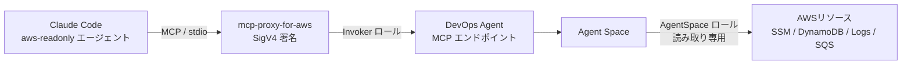

## はじめに

個人の AWS アカウントを Terraform で管理しながら、RSS を取得して DynamoDB に記録し、通知を飛ばす仕組みを動かしています。開発は Claude Code で進めているのですが、`terraform apply` が終わったあとの確認が地味に面倒でした。DynamoDB にレコードが入っているか、SQS の DLQ にメッセージが溜まっていないか、Lambda のログにエラーが出ていないか。コードは Claude Code に書いてもらっているのに、結果の確認だけマネジメントコンソールを開いて自分でやる、という状態です。

「じゃあ Claude Code に aws CLI を叩かせればいいのでは」と考えて、そこで止まりました。ローカルにあるのは管理者権限のプロファイルで、それをそのまま渡すのは怖い。プロンプトに「読み取りしかしないで」と書くことはできますが、それは自制のお願いであって権限の担保ではありません。事故が起きたときに「そう指示したはずなんですが」では困ります。

最初は「読み取り専用の IAM ロールを自分で作り、そのロールで aws CLI を叩く自作エージェント」を作るつもりでした。ところが着手時に調べ直したら、AWS DevOps Agent が MCP リモートサーバに対応していることを知ります。こちらはエージェントの AWS 側権限が AWS 管理ポリシー付きの IAM ロールで決まるため、自作ロール + プロンプトによる自制よりも強い担保が得られます。方針を変えて、こちらで組むことにしました。

結果として、AWS DevOps Agent の Agent Space を Terraform で構築し、Claude Code から MCP（SigV4 認証）経由で呼び出す構成になりました。Claude 側の認証情報や指示に関係なく **IAM レベルで読み取り専用が担保される**のがポイントです。

## この記事で学べること

- AWS DevOps Agent の Agent Space を Terraform（awscc provider）でデプロイする方法と、その際の注意点（タグ形式、IAM 伝搬待ち）
- 権限を「Claude Code 側（呼び出し）」と「エージェント側（AWS リソースアクセス）」に分離する IAM ロール 3 本の設計
- MCP エンドポイントの認証で、アクセストークンではなく SigV4 を選んだ理由（トークンの 60 日失効とローテーション問題）
- Claude Code のサブエージェントで「aws CLI を使わない」をプロンプトではなくツール制限で担保する書き方
- 実際にハマった点（`locale` の BCP 47 形式、エージェントのリージョン走査、読み取り専用ポリシーで答えられないこと）

## 想定読者

- Claude Code などの AI エージェントに AWS の状態確認を任せたいが、権限の渡し方に不安がある方
- AWS DevOps Agent を試したい、あるいは Terraform で構成管理したい方
- MCP サーバの認証方式（アクセストークン / SigV4）の選び方で迷っている方

Terraform と IAM の基本的な読み書きができる前提で書いています。

:::note
この記事は Claude Code を使って執筆しています。ただし、記載している構成はすべて筆者自身が実際に構築・検証したものであり、内容は筆者が確認したうえで公開しています。技術選定の判断や意見も筆者自身のものです。
:::

## AWS DevOps Agent とは

AWS DevOps Agent は、AWS アカウント内のリソースを調査・分析してくれるマネージドな AI エージェントです。Agent Space という単位で作成し、監視対象のアカウントを関連付けて使います。

今回の構成で重要なのは次の 2 点です。

- **MCP リモートサーバを提供している**（2026 年 6 月頃から）。Claude Code などの MCP クライアントから直接呼び出せる
- **Agent の AWS 側権限は、こちらが用意した IAM ロールで決まる**。AWS 管理ポリシー `AIDevOpsAgentAccessPolicy` はほぼ読み取り専用（書き込みは `cloudtrail:StartQuery` と `support:CreateCase` のみ）

はじめに書いたとおり、当初は自作エージェントで済ませるつもりでした。着手時に調べ直したことで MCP 対応を知り、方針を変えられたわけです。「自作する前に、同じ目的のマネージドサービスが増えていないか着手時に調べ直す」は今回の教訓の一つでした。

## 全体構成

確認の流れは次のとおりです。



1. Claude Code のサブエージェント `aws-readonly` が MCP ツール（`chat` など）で質問を送る
2. ローカルの `mcp-proxy-for-aws` が呼び出し用ロール（Invoker）の認証情報で SigV4 署名し、DevOps Agent の MCP エンドポイントへ中継する
3. Agent が Agent Space 用ロール（読み取り専用）を assume して AWS リソースを調査し、回答を返す

ポイントは、**Claude Code 側の権限（Invoker ロール）と Agent の AWS 側権限（AgentSpace ロール）が分離されている**ことです。Invoker ロールにできるのは「Agent とチャットして結果を読む」だけで、AWS リソースへ直接アクセスする権限はありません。

## Terraform 実装

### Agent Space は awscc provider で作る

Agent Space と Association は aws provider にリソースが無く、Cloud Control API 経由の awscc provider で作ります。

```hcl
resource "awscc_devopsagent_agent_space" "this" {
  name        = var.agent_space_name
  description = var.agent_space_description
  locale      = "ja-JP" # 応答言語。BCP 47 形式

  operator_app = {
    iam = {
      operator_app_role_arn = aws_iam_role.operator_app.arn
    }
  }

  tags = local.awscc_tags

  depends_on = [time_sleep.wait_for_iam_propagation]
}

# 自アカウントを monitor として関連付ける。全リージョンのリソースが調査対象になる
resource "awscc_devopsagent_association" "this_account" {
  agent_space_id = awscc_devopsagent_agent_space.this.agent_space_id
  service_id     = "aws"

  configuration = {
    aws = {
      account_id         = local.account_id
      account_type       = "monitor"
      assumable_role_arn = aws_iam_role.agent_space.arn
      resources          = []
    }
  }
}
```

awscc provider 特有の注意点が 2 つあります。

**タグの形式が違う。** awscc provider には `default_tags` が無く、タグは `{key, value}` のリスト形式です。aws provider 用の共通タグ map を変換して渡します。

```hcl
locals {
  common_tags = {
    ManagedBy = "terraform"
    Project   = "my-aws"
  }

  # awscc provider のタグは {key, value} のリスト形式
  awscc_tags = [for k, v in local.common_tags : { key = k, value = v }]
}
```

**IAM ロールの伝搬待ちが要る。** IAM ロール作成直後に Agent Space を作ると、信頼ポリシーの検証に失敗することがあります。`time_sleep` で 30 秒待ってから作成するようにしました。

```hcl
resource "time_sleep" "wait_for_iam_propagation" {
  create_duration = "30s"

  depends_on = [
    aws_iam_role_policy_attachment.agent_space,
    aws_iam_role_policy.agent_space_slr,
    aws_iam_role_policy_attachment.operator_app,
  ]
}
```

### IAM ロールは 3 本

| ロール | 誰が assume するか | 権限 |
| --- | --- | --- |
| AgentSpace | DevOps Agent サービス | `AIDevOpsAgentAccessPolicy`（ほぼ読み取り専用）+ Resource Explorer の SLR 作成 |
| OperatorApp | DevOps Agent サービス | `AIDevOpsOperatorAppAccessPolicy`（Web アプリ用） |
| Invoker | ローカルの管理者プロファイル | チャット / 参照系の `aidevops` アクションのみ |

AgentSpace ロールと OperatorApp ロールの信頼ポリシーは、`aidevops.amazonaws.com` だけが引き受けられる形にした上で、`aws:SourceAccount` と `aws:SourceArn` で「このアカウントの Agent Space から」に絞り、混乱した代理（confused deputy）を防ぎます。

```hcl
data "aws_iam_policy_document" "agent_space_trust" {
  statement {
    effect  = "Allow"
    actions = ["sts:AssumeRole"]

    principals {
      type        = "Service"
      identifiers = ["aidevops.amazonaws.com"]
    }

    condition {
      test     = "StringEquals"
      variable = "aws:SourceAccount"
      values   = [local.account_id]
    }

    condition {
      test     = "ArnLike"
      variable = "aws:SourceArn"
      # 作成前は ID が確定しないのでワイルドカード
      values   = ["arn:${local.partition}:aidevops:${var.region}:${local.account_id}:agentspace/*"]
    }
  }
}
```

Claude Code が使う Invoker ロールは、チャットと結果参照に必要な `aidevops` アクションだけを、この Agent Space の ARN に限定して許可します。アクセストークン管理や Agent Space の変更は含めません。

```hcl
data "aws_iam_policy_document" "invoker" {
  statement {
    sid    = "ChatWithAgentSpace"
    effect = "Allow"
    actions = [
      "aidevops:GetAgentSpace",
      "aidevops:CreateChat",
      "aidevops:SendMessage",
      "aidevops:ListChats",
      "aidevops:ListPendingMessages",
      "aidevops:InvokeAgent",
      "aidevops:ListExecutions",
      "aidevops:ListJournalRecords",
      "aidevops:ListRecommendations",
      "aidevops:GetRecommendation",
      # ...
    ]
    resources = [
      awscc_devopsagent_agent_space.this.arn,
      "${awscc_devopsagent_agent_space.this.arn}/*",
    ]
  }

  # Agent Space に紐づかない参照系（Resource は * が必要）
  statement {
    sid       = "ListAgentSpaces"
    effect    = "Allow"
    actions   = ["aidevops:ListAgentSpaces", "aidevops:GetAccountUsage"]
    resources = ["*"]
  }
}
```

チャットや実行履歴などサブリソースの ARN 形式はドキュメントに明記が無く、Resource を絞りすぎると AccessDenied になる懸念がありました。`agentspace/<id>` と `agentspace/<id>/*` の両方を許可し、apply 後に実際の `chat` 呼び出しで AccessDenied が出ないことを確認しています。plan や validate では分からないため、「マージ後に実 API で検証する」を Issue のチェックリストに入れておくのが安全です。

## 認証はアクセストークンではなく SigV4

DevOps Agent の MCP エンドポイントへの認証は、アクセストークン（Bearer）と SigV4 の 2 通りがあります。最初はアクセストークンで進めていたのですが、**トークンが最長 60 日で失効し、ローテーションが必要**という点が引っかかりました。`RotateAccessToken` を自動化しても、新しいトークンをローカルへ配布するのに結局 AWS 認証情報が要るため、自動化しきれません。

そこで [mcp-proxy-for-aws](https://github.com/aws/mcp-proxy-for-aws) を使った SigV4 認証に切り替えました。ローカルの AWS 認証情報（Invoker ロールを assume するプロファイル）でリクエストに署名する方式です。proxy は毎リクエストで認証情報を読み直すため、STS セッションの期限切れも意識する必要がなく、**ローテーション作業がゼロ**になります。監査も CloudTrail の IAM ロールセッションに一本化されます。

`~/.aws/config` に呼び出し用プロファイルを 1 回だけ設定します。

```ini
[profile devops-agent]
role_arn          = <Invoker ロールの ARN>
source_profile    = <管理者プロファイル名>
region            = ap-northeast-1
role_session_name = claude-code
```

`.mcp.json` はリポジトリにコミットし、プロファイル名などの個人差分は `${VAR:-default}` 記法の環境変数で吸収します。

```json
{
  "mcpServers": {
    "aws-devops-agent": {
      "type": "stdio",
      "command": "uvx",
      "args": [
        "mcp-proxy-for-aws@1.6.4",
        "https://connect.aidevops.ap-northeast-1.api.aws/mcp",
        "--service", "aidevops",
        "--region", "ap-northeast-1",
        "--profile", "${DEVOPS_AGENT_PROFILE:-devops-agent}",
        "--read-timeout", "120"
      ],
      "timeout": 120000
    }
  }
}
```

## Claude Code 側: aws-readonly サブエージェント

AWS の状態確認は、専用のサブエージェント `.claude/agents/aws-readonly.md` 経由で行うようにしました。ポイントは **「aws CLI を使わない」をプロンプトの自制ではなくツール制限で担保する**ことです。frontmatter の `tools` に Bash を含めず、DevOps Agent の MCP ツールと読み取り系ツールだけを許可します。

```yaml
---
name: aws-readonly
description: AWS の現在の状態を AWS DevOps Agent に問い合わせて確認する読み取り専用エージェント。
tools: Read, Grep, Glob, mcp__aws-devops-agent__list_agent_spaces, mcp__aws-devops-agent__chat, mcp__aws-devops-agent__send_message, ...
---
```

運用上の工夫を 3 つ挙げます。

**最初に `list_agent_spaces` で Agent Space を特定する。** SigV4 モードではツール呼び出しに `agent_space_id` が必要なため、エージェントの手順に「最初に `list_agent_spaces` を呼んで ID を取り、以降の呼び出しに渡す」を入れています。

**質問はローカル文脈を添えて 1 回にまとめる。** リソース名を推測で渡さず、先に Terraform コードを読んで具体名を特定してから質問を組み立てます。

```text
[Local Context]
構成管理: Terraform
DynamoDB table: whatsnew-rss-history
SQS DLQ: whatsnew-dlq
Log group: /aws/lambda/whatsnew-notifier

[Question]
1. whatsnew-rss-history の ItemCount と最終更新時刻を教えて
2. whatsnew-dlq の ApproximateNumberOfMessages は 0 か
3. /aws/lambda/whatsnew-notifier の直近 1 時間に ERROR を含むログはあるか
```

**言い回しで応答時間をコントロールする。** 「List / Show / 確認して」系は速く返ってきますが、「Investigate / 根本原因を調べて」系は深い調査（5〜8 分)に入り、時間と料金がかかります。深い調査はユーザーが明示的に求めたときだけ使うルールにしました。

実際に、RSS を DynamoDB に記録して通知する仕組みの確認を依頼したところ、テーブルの ItemCount 221 / ACTIVE、DLQ の滞留 0、直近 1 時間のエラーログなし、まで一度の質問で返ってきました。


`aws-readonly` エージェントがバックグラウンドで DevOps Agent に問い合わせ、55 秒で ItemCount / TableSizeBytes / TableStatus / リージョンを返してきました。

## つまずいた点

### locale は BCP 47 形式（`ja_JP` はエラー）

Agent Space の `locale` を `ja_JP` と書いていたら、CloudFormation の `AWS::DevOpsAgent::AgentSpace` の `Locale` は `^[a-zA-Z]{2,3}(-[a-zA-Z0-9]{2,8})*$`（ハイフン区切りの BCP 47）で、アンダースコア区切りは不正でした。`ja-JP` に修正し、variable に同じ正規表現の validation を追加しています。

```hcl
variable "agent_locale" {
  type    = string
  default = "ja-JP"

  validation {
    condition     = var.agent_locale == null || can(regex("^[a-zA-Z]{2,3}(-[a-zA-Z0-9]{2,8})*$", var.agent_locale))
    error_message = "agent_locale は \"ja-JP\" のような BCP 47 形式で指定すること。"
  }
}
```

注意したいのは、awscc provider のドキュメントには型しか書かれておらず、値の制約は CloudFormation リソースリファレンス側にしか載っていない点です。`terraform validate` では通ってしまうので、apply 前に CloudFormation 側のドキュメントを見ておかないと CI の apply で初めて落ちます。

### Agent のリージョン走査

ローカル文脈で `region ap-northeast-1` を渡しても、Agent は最初に us-east-1 でロググループを探してから他リージョンを走査することがありました。最終的には見つかり回答は正しかったのですが、質問テンプレートでリソースごとにリージョンを明記するのが良さそうです。

### 権限上の制約を知っておく

`AIDevOpsAgentAccessPolicy` は読み取り専用とはいえ、すべてが読めるわけではありません。答えられないことを把握しておかないと、エージェントが「確認できない」理由に迷います。

| 確認したいこと | ポリシーの状況 | 代替 |
| --- | --- | --- |
| DynamoDB の正確な件数・項目 | `dynamodb:Scan/Query/GetItem` なし | `DescribeTable` の ItemCount（約 6 時間遅れの概算） |
| DLQ メッセージの中身 | `sqs:ReceiveMessage` なし | `GetQueueAttributes` で滞留数だけ確認 |
| SSM SecureString の値 | `kms:Decrypt` なし | 存在と String 型の値は確認可 |
| S3 オブジェクトの中身 | `s3:GetObject` なし | バケット設定・ポリシーの確認まで |

この制約表はサブエージェントの定義にも書いておき、「この方法では確認できない」と代替案付きで明言させるようにしています。

## まとめ

- AWS DevOps Agent の Agent Space を Terraform（awscc provider）で構築し、Claude Code から MCP 経由で AWS の状態確認ができるようにした
- Agent の AWS 側権限は AWS 管理ポリシー `AIDevOpsAgentAccessPolicy` 付きの IAM ロールで決まるため、プロンプトの自制ではなく IAM レベルで読み取り専用を担保できる
- 認証はアクセストークン（60 日で失効）ではなく、mcp-proxy-for-aws による SigV4 + 最小権限の呼び出し用ロールにすることで、ローテーション作業をゼロにした
- Claude Code 側はサブエージェントのツール allowlist から Bash を外し、「aws CLI を使わない」もツール制限で担保した

「自作する前にマネージドサービスを調べ直す」「失効する資格情報を運用に入れない」あたりは、この構成に限らず使える教訓だと思います。Claude Code に AWS を触らせたいが権限が気になる、という方の参考になれば幸いです。

## 参考資料

### AWS DevOps Agent

- [About AWS DevOps Agent](https://docs.aws.amazon.com/devopsagent/latest/userguide/about-aws-devops-agent.html)
- [Connect to DevOps Agent remote servers](https://docs.aws.amazon.com/devopsagent/latest/userguide/accessing-devops-agent-connect-to-devops-agent-remote-servers.html)
- [Getting started with AWS DevOps Agent using Terraform](https://docs.aws.amazon.com/devopsagent/latest/userguide/getting-started-with-aws-devops-agent-getting-started-with-aws-devops-agent-using-terraform.html)
- [DevOps Agent IAM permissions](https://docs.aws.amazon.com/devopsagent/latest/userguide/aws-devops-agent-security-devops-agent-iam-permissions.html)
- [Limiting Agent Access in an AWS Account](https://docs.aws.amazon.com/devopsagent/latest/userguide/aws-devops-agent-security-limiting-agent-access-in-an-aws-account.html)
- [AIDevOpsAgentFullAccess - AWS Managed Policy](https://docs.aws.amazon.com/aws-managed-policy/latest/reference/AIDevOpsAgentFullAccess.html)

### Terraform / CloudFormation

- [awscc_devopsagent_agent_space | hashicorp/awscc | Terraform Registry](https://registry.terraform.io/providers/hashicorp/awscc/latest/docs/resources/devopsagent_agent_space)
- [AWS::DevOpsAgent::AgentSpace - AWS CloudFormation](https://docs.aws.amazon.com/AWSCloudFormation/latest/TemplateReference/aws-resource-devopsagent-agentspace.html)
- [AWS::DevOpsAgent::Association - AWS CloudFormation](https://docs.aws.amazon.com/AWSCloudFormation/latest/TemplateReference/aws-resource-devopsagent-association.html)
- [The confused deputy problem - AWS IAM User Guide](https://docs.aws.amazon.com/IAM/latest/UserGuide/confused-deputy.html)

### MCP / Claude Code

- [aws/mcp-proxy-for-aws - GitHub](https://github.com/aws/mcp-proxy-for-aws)
- [Create custom subagents - Claude Code Docs](https://code.claude.com/docs/en/sub-agents)
