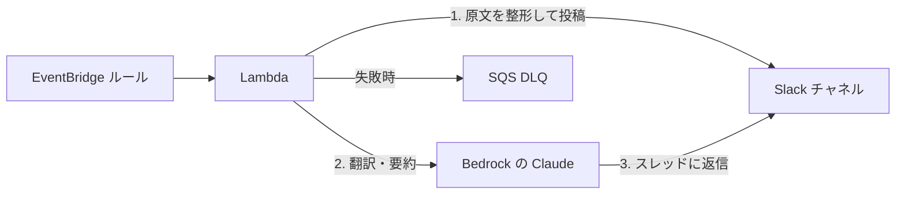

## はじめに

AWSアカウントを運用していると、Health のメンテナンス通知、セキュリティの Finding、コスト異常など、見逃したくない通知が複数のサービスからバラバラに届きます。しかも原文は英語で、メールボックスの中に埋もれがちです。

そこで、AWS の重要通知を EventBridge で拾って Slack に集約し、さらに Bedrock の Claude が日本語訳・要約と推奨対応を同じスレッドに返信してくれる仕組みを Terraform で構築しました。この記事では構成のポイントと、リリースまでにつまずいた点を紹介します。

## この記事で学べること

- EventBridge で拾った AWS の通知を Lambda 経由で Slack に集約し、Bedrock の Claude が日本語要約をスレッド返信する構成の作り方
- 通知がノイズにならないように、EventBridge のイベントパターンで対象を絞り込む書き方（GuardDuty の重大度、Security Hub の CRITICAL / HIGH など）
- 原文の第一報と AI 要約を分けて投稿し、リトライ 0 回 + DLQ 退避で二重投稿を防ぐ設計
- us-east-1 にしか配信されないイベント（Health のグローバルイベント、Cost Anomaly Detection）をクロスリージョン転送で拾う方法
- Bedrock の Anthropic モデルで「model not available for this account」に遭遇したときの、IAM 権限・モデル ID・アカウント開放という3つの層の切り分け方
- Terraform と GitHub Actions で運用に乗せる際につまずいた点（AWS が自動作成する既存リソースとの衝突、`__pycache__` によるソースハッシュの汚染、OIDC 信頼ポリシー）とその回避策

## 想定読者

- AWS の重要通知が複数サービスからバラバラに届いていて、Slack に集約したい人
- 英語の通知原文を読むのが負担で、日本語の要旨と推奨対応を自動で添えたい人
- Bedrock を単発の検証ではなく、運用する仕組みの一部として組み込んでみたい人
- 通知基盤を手作業ではなく Terraform でコード管理したい人

前提知識として、Terraform の基本的な記法と、AWS の Lambda / EventBridge / IAM の概要を理解していることを想定しています。

## 作ったもの

通知の流れは次のとおりです。



1. EventBridge ルールが対象イベントを拾って Lambda（Python 3.13 / arm64）を非同期呼び出し
2. Lambda が原文を整形して Slack に第一報を投稿（`chat.postMessage` で `ts` を取得）
3. Bedrock の Claude にイベント JSON を渡して日本語訳・要約を生成
4. `thread_ts` 付きで同じスレッドに要約を返信
5. 処理に失敗したイベントは SQS の DLQ へ退避

Slack 側では「英語の第一報の下に、日本語の要旨と推奨対応がスレッドでぶら下がる」形になります。原文と AI 生成物が分離されるので、要約の精度に不安があっても原文にすぐ当たれます。

## 通知対象と絞り込み

通知対象は次の4種類です。全部を垂れ流すとノイズになるため、EventBridge のイベントパターンで絞り込んでいます。

| 対象 | 絞り込み条件 |
| --- | --- |
| AWS Health | すべて（サービス障害・計画メンテ・アカウント通知） |
| GuardDuty | 重大度 4（MEDIUM）以上の Finding |
| Security Hub | CRITICAL / HIGH かつ新規（NEW）の Finding |
| Cost Anomaly Detection | 影響額がしきい値（USD）以上の異常のみ |

たとえば GuardDuty のルールは、イベントパターンの numeric マッチで重大度をフィルタしています。

```hcl
guardduty = {
  description = "GuardDuty の重大度 MEDIUM 以上の Finding を通知する"
  pattern = {
    source        = ["aws.guardduty"]
    "detail-type" = ["GuardDuty Finding"]
    detail = {
      severity = [{ numeric = [">=", 4] }]
    }
  }
}
```

## 設計のポイント

### 第一報と AI 要約を分ける

Lambda の処理は「第一報の投稿」→「AI 要約のスレッド返信」の順にしています。Bedrock の呼び出しが失敗しても第一報は届いているので、通知としての役割は果たせます。

また、非同期呼び出しのリトライを 0 回にして、失敗イベントは DLQ に退避する構成にしました。リトライを許すと「第一報投稿後、要約生成で失敗 → リトライで第一報が二重投稿」が起きるためです。

```hcl
resource "aws_lambda_function_event_invoke_config" "notifier" {
  function_name = aws_lambda_function.notifier.function_name

  maximum_retry_attempts = 0

  destination_config {
    on_failure {
      destination = aws_sqs_queue.dlq.arn
    }
  }
}
```

### us-east-1 にしか届かないイベントの転送

Health のグローバルイベント（IAM など）と Cost Anomaly Detection のイベントは us-east-1 にのみ配信されます。EventBridge ルールのターゲットには同一リージョンの Lambda しか指定できないため、us-east-1 側に転送ルールを置き、ap-northeast-1 のデフォルトイベントバスへクロスリージョン転送しています。

転送されてきてもイベントの `source` は元のまま（`aws.health` など）なので、ap-northeast-1 側のルールがそのままマッチします。転送用に EventBridge が引き受ける IAM ロール（`events:PutEvents` のみ許可）が1つ必要です。

### Cost Anomaly Detection の即時アラートには SNS が必須

Cost Anomaly Detection が EventBridge に `Anomaly Detected` イベントを発行するのは「即時アラート（IMMEDIATE）」の購読があるときだけです。そして IMMEDIATE 購読には SNS サブスクライバーの指定が必須という制約があります。

通知の本経路は EventBridge → Lambda なので、SNS トピック自体は誰も購読しない「要件を満たすためだけのトピック」として作成しました。

### プロンプトは Markdown ファイルで管理

Claude に渡すプロンプトは Terraform や Python に埋め込まず、`lambda/prompt.md` という単独ファイルにしています。出力形式（日本語訳の要旨 + 推奨対応）や「原文にない情報は推測であることを明記する」といった指示をここで管理し、変更は通常の PR フローに乗せます。

Lambda のデプロイパッケージはソースツリーのハッシュで変更検知しているため、prompt.md を編集すると自動的に Lambda が再デプロイされます。

### Slack Bot Token は Terraform 管理外

Slack の Bot Token は tfvars や state に残したくないので、SSM パラメータストアの SecureString に手動で1回だけ登録し、Lambda が実行時に取得する方式にしました。シェル履歴にも残らないよう `read -s` で入力してから `aws ssm put-parameter` を実行しています。

### Bedrock の呼び出し

Lambda からは anthropic SDK の `AnthropicBedrock` クライアントを使い、東京リージョンのクロスリージョン推論プロファイル `jp.anthropic.claude-sonnet-4-6` を呼び出しています。

```python
from anthropic import AnthropicBedrock

client = AnthropicBedrock(
    aws_region=os.environ.get("BEDROCK_REGION", "ap-northeast-1")
)
response = client.messages.create(
    model=os.environ.get("BEDROCK_MODEL_ID", "jp.anthropic.claude-sonnet-4-6"),
    max_tokens=2048,
    messages=[{"role": "user", "content": build_prompt(event)}],
)
```

IAM は推論プロファイル経由の呼び出しの場合、プロファイルと転送先の foundation-model の両方に `bedrock:InvokeModel` の許可が必要な点に注意が必要です。

## つまずいたところ

リリースまでに実際に踏んだ問題です。plan では見えず apply や疎通テストで初めて発覚したものが多くありました。

### 1. 既定の Cost Anomaly モニターと衝突して apply が失敗

SERVICE ディメンションの Cost Anomaly モニターはアカウントに1つしか作れません。AWS が自動作成した既定モニター（Default-Services-Monitor）が既に存在していたため、新規作成の apply が失敗しました。

対応として、Terraform の import ブロックで既定モニターを管理下に取り込み、名前を付け替えました。

```hcl
import {
  to = aws_ce_anomaly_monitor.services
  id = "arn:aws:ce::<account-id>:anomalymonitor/<monitor-id>"
}
```

この手の「AWS が自動作成するリソースとの衝突」は plan では検出できないのが厄介です。アカウント単位の上限があるリソースは、apply 前に既存リソースを確認しておくべきでした。

### 2. `__pycache__` がソースハッシュに混入して偽の再ビルド差分

Lambda の変更検知にソースツリーのハッシュを使っていたところ、ローカルで pytest を実行すると生成される `__pycache__` がハッシュに混入し、コードを変えていないのに毎回再ビルド差分が出るようになりました。`fileset` の結果から `__pycache__` を除外して解消しています。

```hcl
lambda_src_hash = sha256(join("", [
  for f in sort(fileset(local.lambda_src_dir, "**")) : filesha256("${local.lambda_src_dir}/${f}")
  if !strcontains(f, "__pycache__")
]))
```

### 3. Bedrock の「model not available for this account」

疎通テストで一番はまったのがここです。当初は最新世代のモデルを使う想定でしたが、呼び出すと `model not available for this account` が返ってきました。

調べた結果、Bedrock の Anthropic モデルには利用可否の層が複数あることが分かりました。

- **利用用途フォームの提出**（アカウントごとに1回）
- **アカウント開放の範囲**: 最新世代モデル（Opus 4.8 / 4.7 / Sonnet 5）と Mantle エンドポイントは、フォームやアグリーメントとは別に AWS Sales 経由の開放が必要な場合がある

さらに、開放待ちの間に試した Mantle エンドポイントは IAM アクションが `bedrock-mantle:CreateInference` という別物で、`bedrock:InvokeModel` を許可しても 403 になるという二段構えでした。

最終的に、従来エンドポイント + `jp.anthropic.claude-sonnet-4-6` の構成に切り替えて解決しました。モデル ID は環境変数化してあるので、開放され次第 tfvars の差し替えだけで最新モデルへ移行できます。

「アクセスできない」系のエラーは、IAM 権限・モデル ID の形式・アカウント開放のどの層で弾かれているかをエラーメッセージの主体（IAM の AccessDenied か、サービス側の permission_error か）で切り分けるのが近道です。

### 4. CI の OIDC 信頼ポリシーが Pull Request からの実行を拒否

この層は GitHub Actions から terraform plan / apply する CI に乗せていますが、初めて PR を作ったら plan が全レイヤーで失敗しました。原因は、CI ロールの OIDC 信頼ポリシーが main ブランチの ref しか許可しておらず、pull_request イベントの sub（`...:pull_request`）を拒否していたことでした。

CI の経路は初回実行まで壊れていても気づけません。新しいイベント種別を使うワークフローを追加したら、意図的に一度発火させて認証まで通ることを確認しておくべきでした。

## 動作確認

Lambda のテスト機能からサンプルイベント（AWS Health 形式）を流し、Slack に第一報が投稿され、スレッドに日本語の要旨と推奨対応が返信されることを確認しました。DLQ にメッセージが残っていないことも合わせて確認しています。

なお、`aws events put-events` でのテストは `Source` に `aws.` で始まる値を指定できない（AWS 予約のため）という制約があり、そのままではルールにマッチしません。疎通テストは Lambda コンソールから直接イベントを流すのが確実でした。

## 今後の改善点

現状の実装は、EventBridge から届いたイベントごとに Slack へ新しいメッセージを投稿します。そのため、AWS Health の同じイベントに続報が出ると、そのたびに別のメッセージとしてチャネルに並びます。長引く障害や、開始時刻が変更される計画メンテナンスでは、同じ件の投稿がチャネル内に散らばって時系列を追いにくくなります。

やりたいのは、同一の Health イベントの続報を第一報のスレッドにぶら下げることです。AWS Health のイベントは `detail.eventArn` が同一イベントの識別子になっていて、続報でも同じ値が入ります。更新時刻は `detail.lastUpdatedTime`、状態は `detail.statusCode`（`open` / `closed` / `upcoming`）で判別できます。

想定している流れは次のとおりです。

1. 第一報を投稿したら、`eventArn` をキーにして Slack の `ts` を DynamoDB に保存する
2. 同じ `eventArn` のイベントが届いたら、保存済みの `ts` を取り出して `thread_ts` に指定し、続報をスレッドに返信する
3. キーが見つからなければ従来どおり新規メッセージとして投稿し、その `ts` を保存する
4. `statusCode` が `closed` になったらスレッドに解決の一報を返し、レコードには TTL を設定して片付ける

注意が必要なのは書き込みの競合です。AWS Health はイベントを少なくとも1回配信する仕様なので、同じ `eventArn` の Lambda が同時に走ると第一報が2本立つ可能性があります。`ts` の保存は条件付き書き込みにして、既にレコードがある場合は返信側に倒す必要がありそうです。

## おわりに

EventBridge + Lambda + Bedrock という小さな構成ですが、「通知が Slack に集まり、開くと日本語の要旨と推奨対応が付いている」体験は想像以上に快適です。

一方で、GuardDuty / Security Hub はサービス自体を有効化するまでイベントが発行されないため、「通知が来ない = 異常なし」ではない点には注意が必要です（有効化は別途進めています）。

同じような仕組みを作る方の参考になれば幸いです。

## 参考資料

### AWS

- [Monitoring events in AWS Health with Amazon EventBridge](https://docs.aws.amazon.com/health/latest/ug/cloudwatch-events-health.html)
- [Reference: AWS Health events Amazon EventBridge schema](https://docs.aws.amazon.com/health/latest/ug/aws-health-events-eventbridge-schema.html)
- [Processing GuardDuty findings with Amazon EventBridge](https://docs.aws.amazon.com/guardduty/latest/ug/guardduty_findings_cloudwatch.html)
- [Security Hub CSPM event types in EventBridge](https://docs.aws.amazon.com/securityhub/latest/userguide/securityhub-cwe-integration-types.html)
- [Getting started with AWS Cost Anomaly Detection](https://docs.aws.amazon.com/cost-management/latest/userguide/getting-started-ad.html)
- [Sending and receiving events between AWS Regions in Amazon EventBridge](https://docs.aws.amazon.com/eventbridge/latest/userguide/eb-cross-region.html)
- [Capturing records of Lambda asynchronous invocations](https://docs.aws.amazon.com/lambda/latest/dg/invocation-async-retain-records.html)
- [Route model inference requests across AWS Regions with cross-Region inference](https://docs.aws.amazon.com/bedrock/latest/userguide/cross-region-inference.html)
- [Prerequisites for inference profiles](https://docs.aws.amazon.com/bedrock/latest/userguide/inference-profiles-prereq.html)

### Terraform / GitHub Actions

- [import block reference](https://developer.hashicorp.com/terraform/language/block/import)
- [Configuring OpenID Connect in Amazon Web Services](https://docs.github.com/en/actions/how-tos/secure-your-work/security-harden-deployments/oidc-in-aws)

### Slack / Anthropic

- [chat.postMessage method](https://docs.slack.dev/reference/methods/chat.postMessage)
- [Claude on Amazon Bedrock (Opus 4.6 and earlier)](https://platform.claude.com/docs/en/build-with-claude/claude-on-amazon-bedrock-legacy)
